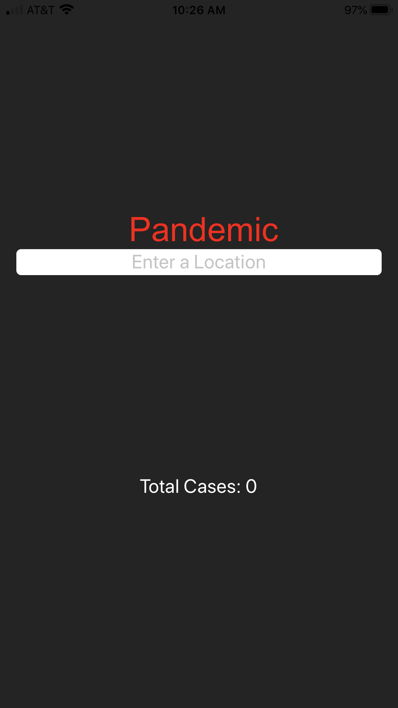
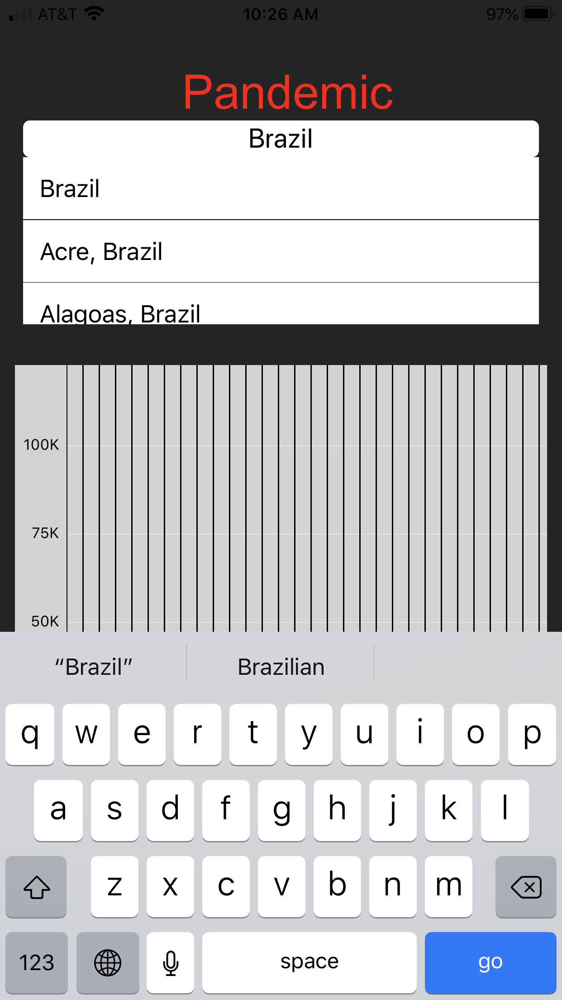
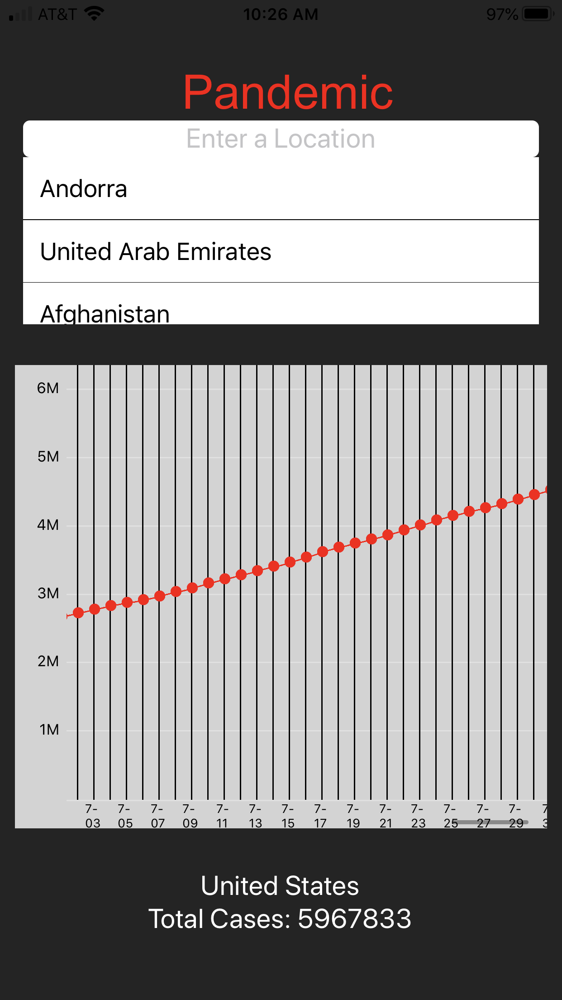
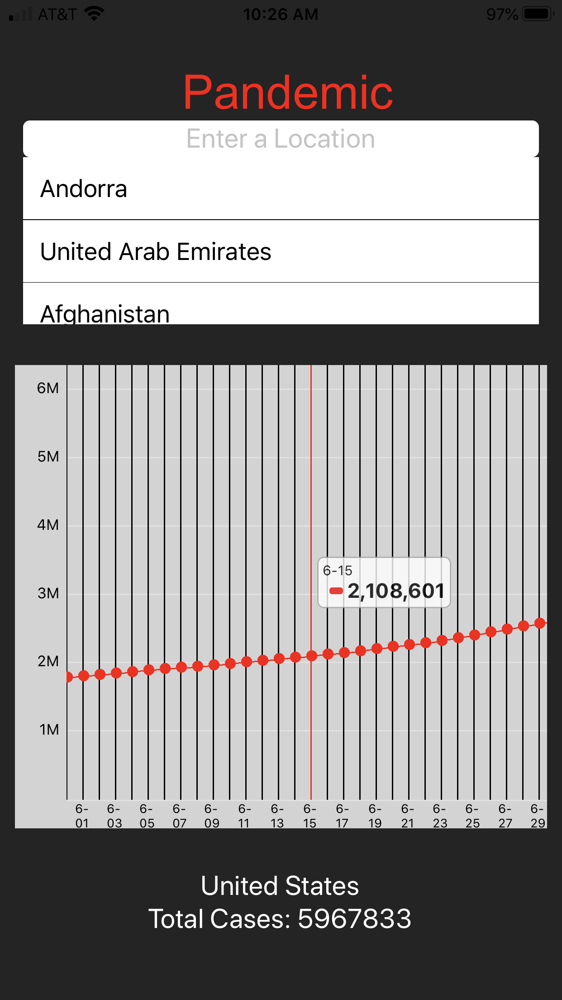

Live coronavirus tracker sourcing data from an API using React on a mobile application. Variables such as deaths, new cases, and recovered cases will be displayed in a graph. Users can either use their current location or input a specific region to view data.

**May 05, 2020 - Completed**

**GitHub Link:**
 <a href="https://github.com/ladeane00/Pandemic">Here</a>

------------------------------------------------|------------------------------------------------ 
- | - |
 | 

------------------------------------------------|------------------------------------------------ 
- | - |
 | 