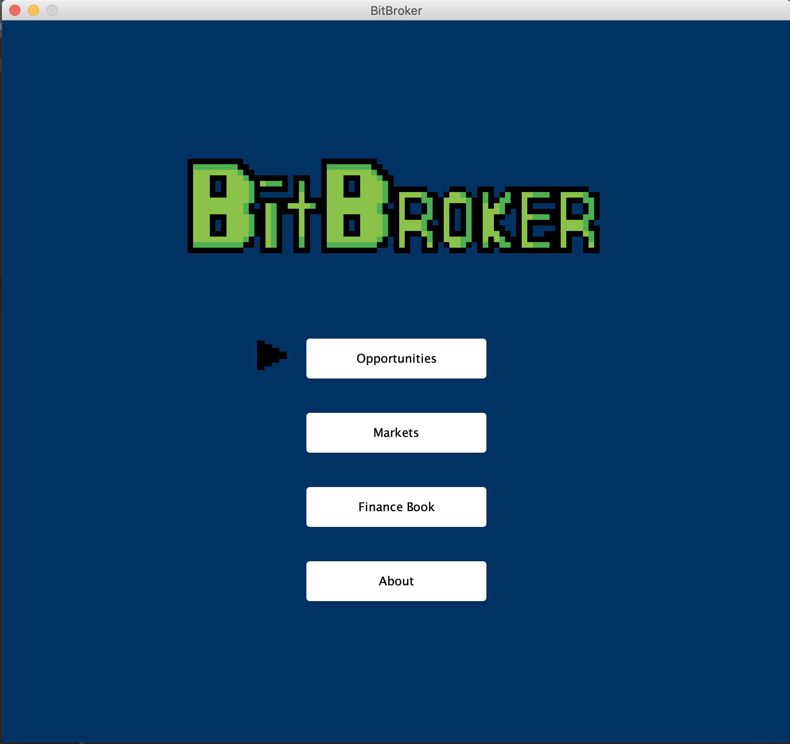
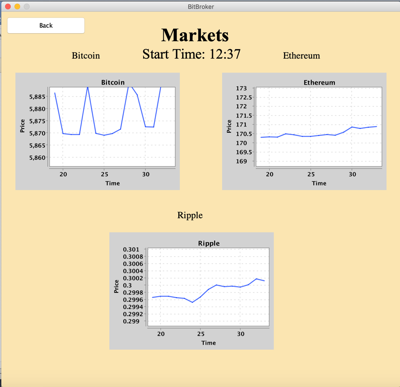
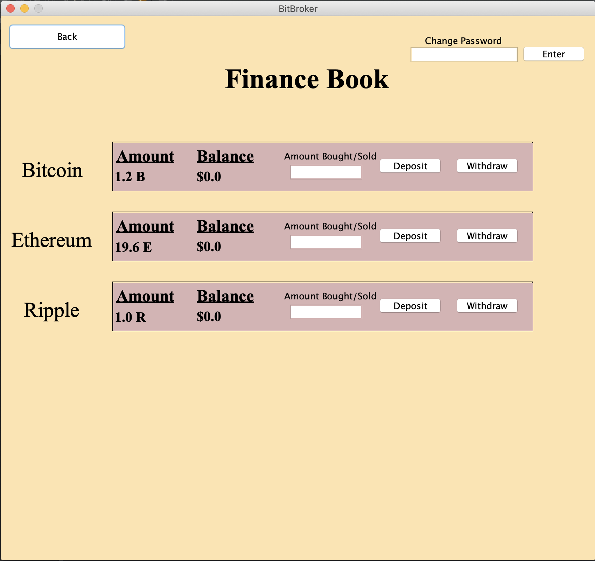
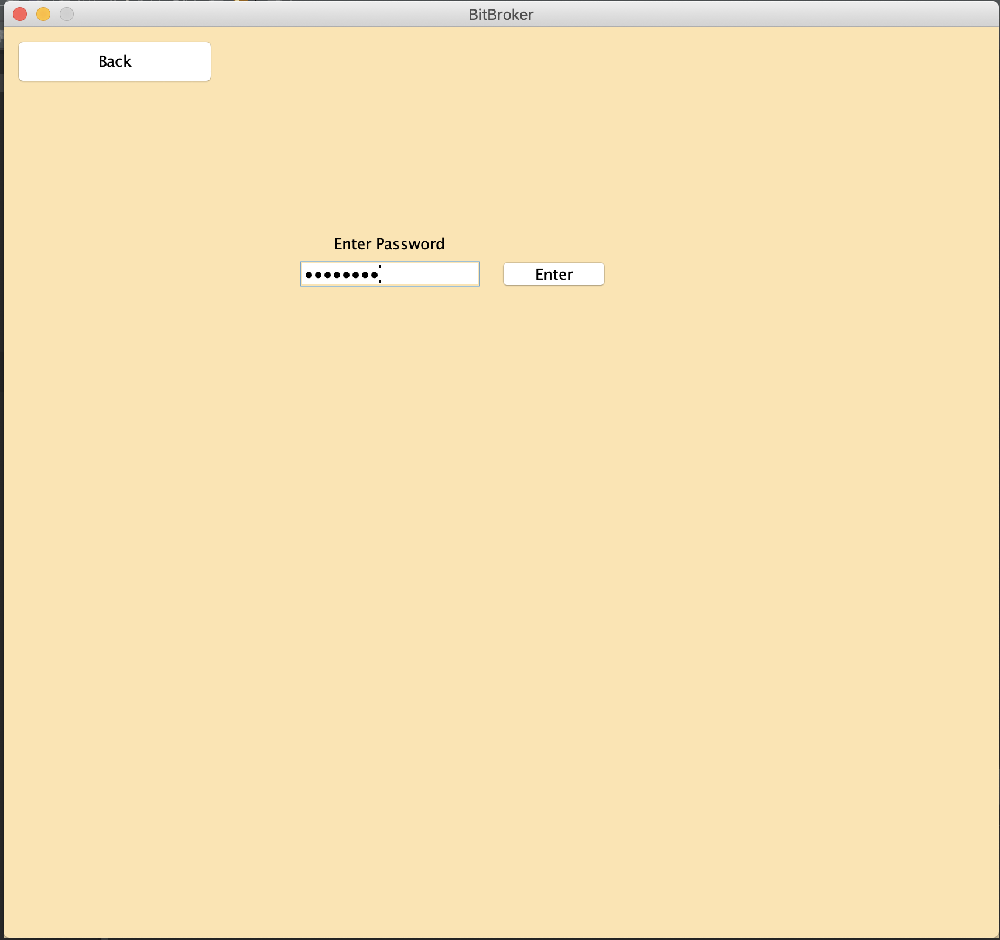
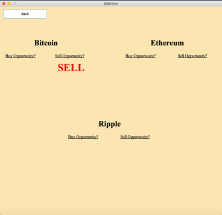

A Java application that shows live statistics by the minute on the top 3 cryptocurrencies: Bitcoin, Ethereum, and Ripple

**May 05, 2020 - Completed**

**GitHub Link:**
 <a href="https://github.com/ladeane00/BitBroker">Here</a>

------------------------------------------------|-----------------------------------------------
- | - |
 | 

------------------------------------------------|------------------------------------------------ 
- | - |
 | 

------------------------------------------------------------------------------------------------|
- | 
 